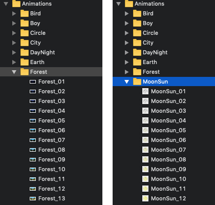
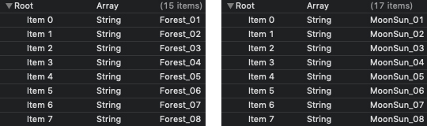

# Customizable Animated Switch

[](http://cocoapods.org/pods/DDAnimatedSwitch)
[](http://cocoapods.org/pods/DDAnimatedSwitch)
[](http://cocoapods.org/pods/DDAnimatedSwitch)
[](https://github.com/Carthage/Carthage)
[](https://developer.apple.com/swift/)

This framework allows you to create and customize all types of switches.
You can setup very complex and very simple switches using just a few lines of code.


An animated switch can use any frame animation. You can animate not only the switch but also the thumb.
Animations can be played, resized, looped, sped up, slowed down and reversed.
You can set any forms, sizes and proportions.


The framework has a large number of settings for animation.
Changing them you will create a unique and beautiful switch.
Here is an another sample.


In addition to animation, you can create customizable switch with labels or images.
All these elements can also be animated and decorated.


<h4>Be careful!!!</h4>
Irreversible consequences are possible during long work with the framework.


## Installation

DDAnimatedSwitch supports [CocoaPods](http://cocoapods.org) and [Carthage](https://github.com/Carthage/Carthage#if-youre-building-for-ios-tvos-or-watchos).

### CocoaPods

To install `DDAnimatedSwitch` via [CocoaPods](http://cocoapods.org), add the following line to your Podfile:

```
pod 'DDAnimatedSwitch'
```

After installing the cocoapod into your project import `DDAnimatedSwitch` with

```
import DDAnimatedSwitch
```

### Carthage

To install `DDAnimatedSwitch` via [Carthage](https://github.com/Carthage/Carthage#if-youre-building-for-ios-tvos-or-watchos), add the following line to your Cartfile:

```
github "d-dotsenko/DDAnimatedSwitch"
```

And then run:

```
carthage update
```

### Manually

Add `DDAnimatedSwitch` folder to your Xcode project.

## Usage

The framework contains several basic classes. Each class allows you to create and configure a specific type of switch.
All this classes inherited from `DDSwitch`
If you need a custom switch with animated labels - create switch inheriting from `DDLabelSwitch`


If you need a custom switch with animated images - create switch inheriting from `DDImageSwitch`


if you need a custom switch with frame animation of the switch and / or thumb - create switch inheriting from `DDAnimatedSwitch`


if you need just a unique and beautiful switch - create class inheriting from `DDSwitch`


See the example Xcode project.

### Quick Start

1) Create a new switch inheriting from `DDAnimatedSwitch`

2) Configuration
Consider an example for `DDLabelSwitch`

```swift
onTintColor = UIColor.orange
offTintColor = UIColor.lightGray

cornerRadius = 0.5
thumbCornerRadius = 0.5
thumbTintColor = UIColor(red: 0.9, green: 0.9, blue: 0.9, alpha: 1)
padding = frame.size.height / 50
let side = frame.size.height - 2 * padding
thumbSize = CGSize(width: side/2, height: side)
duration = 0.8

thumbShadowColor = UIColor.black
thumbShadowOffset = CGSize(width: 0, height: 0)
thumbShadowRadius = 3
thumbShadowOpacity = 0.7

innerShadowColor = UIColor.black
innerShadowRadius = 7
innerShadowOpacity = 0.5

let labelOn = UILabel()
labelOn...

let labelOff = UILabel()
labelOff...

onLabel = labelOn
offLabel = labelOff
```

Consider an example for `DDAnimatedSwitch`

```swift
cornerRadius = 0.5
thumbTintColor = UIColor.clear
padding = frame.size.height / 4
let side = frame.size.height / 1.5
thumbSize = CGSize(width: side, height: side)
duration = 0.8

thumbShadowColor = UIColor.white
thumbShadowOffset = CGSize(width: 0, height: 0)
thumbShadowRadius = 10
thumbShadowOpacity = 1

thumbAnimationName = "MoonSunAnimation"         /// --> frame animation name
backgroundAnimationName = "ForestAnimation"     /// --> frame animation name
```

3) If you want switch with frame animation you have to create it
Add images to assert (main bundle) for switch and / or thumb.



After that, create .plist with names for each animation.



Set for `thumbAnimationName` and / or `backgroundAnimationName` name of plist.

### Customization

```swift
/// DDSwitch
var isOn: Bool /// The switch value
var animated: Bool /// A Boolean value that determines whether switch changes are animated
var duration: CGFloat /// The animation duration value
var padding: CGFloat /// Minimum left/right thumb offset
var onTintColor: UIColor /// The switch background color if thumb is On
var offTintColor: UIColor /// The switch background color if thumb is Off
var thumbTintColor: UIColor /// The thumb background color
var cornerRadius: CGFloat /// The switch corner radius (0.0 ... 0.5)
var thumbCornerRadius: CGFloat /// The thumb corner radius (0.0 ... 0.5)
var thumbSize: CGSize /// The thumb size
var thumbImage: UIImage? /// The thumb image
var isThumbImageColorAnimate: Bool /// A Boolean value that determines whether thumb imageView tint color is
inversed of the switch background color during animation   switch changes are animated
var thumbShadowColor: UIColor /// The thumb shadow color
var thumbShadowOffset: CGSize /// The thumb shadow offset
var thumbShadowRadius: CGFloat /// The thumb shadow radius
var thumbShadowOpacity: Float /// The thumb shadow opacity
var innerShadowColor: UIColor /// Inner shadow collor of the switch
var innerShadowRadius: CGFloat /// Inner shadow radius of the switch
var innerShadowOpacity: Float /// Inner shadow opacity of the switch

/// DDAnimatedSwitch
var thumbAnimationName: String? /// The name of plist with names of frame images for thumb animation
var backgroundAnimationName: String? /// The name of plist with names of frame images for switch animation 

/// DDLabelSwitch
var onLabel: UILabel? /// The label if thumb is On
var offLabel: UILabel? /// The label if thumb is Off

/// DDImageSwitch
var onImageView: UIImageView? /// The image if thumb is On
var offImageView: UIImageView? /// The image if thumb is Off
```

## Requirements

- iOS 9.0
- Xcode 10, Swift 4.2

## License

`DDAnimatedSwitch` is available under the MIT license. See the LICENSE file for more info.
